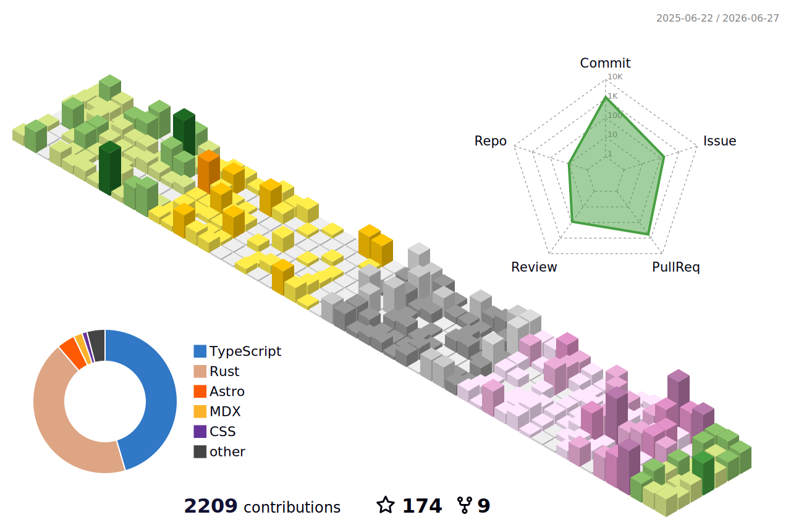

## Hey There! 👋

I'm shm11C3 — a web frontend engineer (React/Vite) working on software products.  
I build HardwareVisualizer (Tauri/Rust/React), a cross-platform hardware monitoring dashboard.
I’m into CI/CD, DevEx, and supply-chain/release automation.

- 💼 Work: Web Engineer — React/Vite, Node.js, Java, AWS (Lambda/Fargate/DynamoDB), Serverless Framework
- 🔥 Main OSS: **HardwareVisualizer** (Tauri + Rust + React)
- 🧰 Interests: Frontend, CI/CD, DevEx, supply-chain, onboarding & platform work

## 🚀 Featured

- **HardwareVisualizer** — cross-platform hardware monitor dashboard (Tauri/Rust)
  - Repo: <https://github.com/shm11C3/HardwareVisualizer>
- **md-xformer** — Markdown transformer / renderer utilities
  - Repo: <https://github.com/shm11C3/md-xformer>

## 💻 Tech Stack

## 📫 Links

- GitHub: <https://github.com/shm11C3>
- X (Twitter): <https://x.com/shm11C3>
- Zenn: <https://zenn.dev/shm_7ec>
- Qiita: <https://qiita.com/shm>

## 📈 stats

